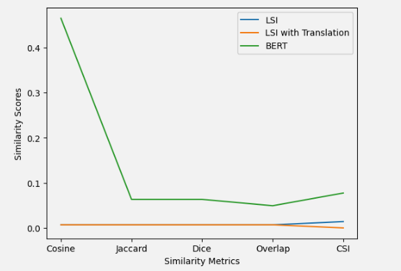

<!-- PROJECT SHIELDS -->
[![Contributors][contributors-shield]][contributors-url]
[![Forks][forks-shield]][forks-url]
[![Stargazers][stars-shield]][stars-url]
[![Issues][issues-shield]][issues-url]
[![LinkedIn][linkedin-shield]][linkedin-url]

<!-- PROJECT LOGO -->
 

<h3 align="center"> Cross lingual information retrieval (CLIR) using BERT</h3>

  

<!--     <a href="https://github.com/youssef-mansor/CLIR-using-BERT">View Demo</a> -->
<!--     · -->
    <a href="https://github.com/youssef-mansor/CLIR-using-BERT/issues">Report Bug</a>
    ·
    <a href="https://github.com/youssef-mansor/CLIR-using-BERT/issues">Request Feature</a>
  

<!-- ABOUT THE PROJECT -->

## About The Project

This project implements cross-lingual information retrieval techniques using BERT (Bidirectional Encoder Representations from Transformers) for English-Turkish language pair. It compares different approaches including Latent Semantic Indexing (LSI), LSI with translation, and BERT-based methods.

The main goal of this project is to evaluate and compare different techniques for cross-lingual information retrieval between English and Turkish. The project explores:

- Latent Semantic Indexing (LSI)
- LSI with Translation
- BERT-based approach

For each approach, various similarity metrics are used:

- Cosine Similarity
- Jaccard Similarity
- Dice Similarity
- Overlap Similarity

## Results

BERT-based method shows significant improvement over traditional LSI and LSI with translation approaches.

## Tech Stack

The project utilizes the following Oracle database technologies:

<!-- MARKDOWN LINKS & IMAGES -->
[contributors-shield]: https://img.shields.io/github/contributors/youssef-mansor/CLIR-using-BERT.svg?style=for-the-badge
[contributors-url]: https://github.com/youssef-mansor/CLIR-using-BERT/graphs/contributors
[forks-shield]: https://img.shields.io/github/forks/youssef-mansor/CLIR-using-BERT.svg?style=for-the-badge
[forks-url]: https://github.com/youssef-mansor/CLIR-using-BERT/network/members
[stars-shield]: https://img.shields.io/github/stars/youssef-mansor/CLIR-using-BERT.svg?style=for-the-badge
[stars-url]: https://github.com/youssef-mansor/CLIR-using-BERT/stargazers
[issues-shield]: https://img.shields.io/github/issues/youssef-mansor/CLIR-using-BERT.svg?style=for-the-badge
[issues-url]: https://github.com/youssef-mansor/CLIR-using-BERT/issues
[license-shield]: https://img.shields.io/github/license/youssef-mansor/CLIR-using-BERT.svg?style=for-the-badge
[license-url]: https://github.com/youssef-mansor/CLIR-using-BERT/blob/main/LICENSE
[linkedin-shield]: https://img.shields.io/badge/-LinkedIn-black.svg?style=for-the-badge&logo=linkedin&colorB=555
[linkedin-url]: https://www.linkedin.com/in/youssef-m-86a690174/
[product-screenshot]: images/screenshot.png

